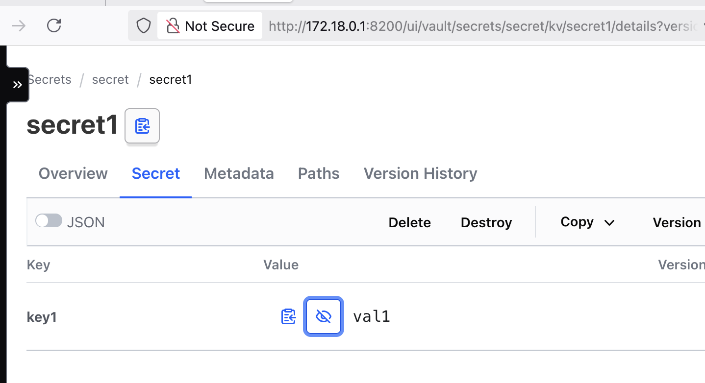

This README is a guide on installing and testing AVP that uses Vault's kv store as its backend (AVP_Type=vault).
 
# Install the AVP sidecar using the token authentication method

```bash
export VAULT_TOKEN="root"

envsubst < secret.yaml | kubectl apply -f -

kubectl apply -f cm.yaml -n argocd

kubectl patch deployment -n argocd argocd-repo-server --patch-file ./patch.yaml
```

# Test AVP

## Create a secret in Vault

```bash
$ brew install vault

$ export VAULT_ADDR=http://172.18.0.9:8200

$ export VAULT_TOKEN=root

$ vault kv put secret/secret1 key1="val1"

$ vault kv get secret/secret1
```



## Test AVP using AVP CLI

```bash
$ brew install argocd-vault-plugin

$ cat test_avp/app/secret.yaml
apiVersion: v1
kind: Secret
metadata:
  name: some-secret
  annotations:
    avp.kubernetes.io/path: "secret/data/secret1"
stringData:
  SOME_SECRET: <key1>

$ argocd-vault-plugin generate ./test_avp/app/secret.yaml
apiVersion: v1
kind: Secret
metadata:
  annotations:
    avp.kubernetes.io/path: secret/data/secret1
  name: some-secret
stringData:
  SOME_SECRET: val1
```

Notice: the value of key1 (val1) should be injected into the secret.

## Test AVP by pushing this repo to a Git forge and creating an Application using app as your path, or by running the following

```bash
kubectl apply -n argocd -f app.yaml
```

Notice: AVP should create a secret valled some-secret with the value of key1 (val1). You can verify this by running the following:

```bash
$ k get secret some-secret -o jsonpath='{.data.SOME_SECRET}' | base64 --decode
val1
```

# Debug AVP

```bash
kubectl get pods -n argocd

kubectl exec -it -n argocd argocd-repo-server-7fd65c7877-nwwg7 -- /bin/bash

```

# Uninstall AVP

```bash
kubectl patch deployment -n argocd argocd-repo-server --patch-file ./remove-patch.yaml
```


